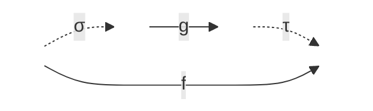

# A well-quasi-order for continuous functions — a Lean 4 formalization

[](https://github.com/yannpequignot/lean-wqo-continuous-functions/actions/workflows/ci.yml)


A **Lean 4** formalization of the results in the preprint
**[A well-quasi-order for continuous functions](https://arxiv.org/abs/2410.13150)**
(R. Carroy & Y. Pequignot). The three main theorems and the central 2-BQO result are
**fully proved and `sorry`-free**; a green [CI run](#-verification--auditing-for-reviewers) is a
machine-checked certificate of that claim (see below).

## 🧠 Mathematical overview

A **well-quasi-order** (WQO) is a quasi-order in which every infinite sequence
$(x_i)_{i\in\mathbb N}$ contains an increasing pair $x_i \le x_j$ with $i < j$. WQO theory
is central to termination arguments, ordinal analysis, and the theory of Borel/continuous
reducibility in descriptive set theory.

We study the following quasi-order on functions.

>**Definition** A function `f : X → Y'` **continuously reduces** to `g : X' → Y'`, written `f ≤ g`, if there is a continuous `σ : X → X'` and a function `τ : Y' → Y` that is continuous on `im(g ∘ σ)` such that `f(x) = τ(g(σ(x)))` for all `x` in `X`.



**A note on the formalization.** The definition above is the memoir's, formalized *verbatim*
as `ContinuouslyReduces_range_based` (with `τ` a bundled continuous map
`im(g ∘ σ) → im f`). The development, however, mostly works with the slightly different
`ContinuouslyReduces`, which asks instead for a **total** map `τ : Y' → Y` that is continuous
*on* `im(g ∘ σ)`. This is far more convenient in Lean: the type of `τ` is then fixed and does
not depend on the data `σ, f, g`, so composing reductions or pre-composing with a homeomorphism
never forces a transport across changing subtypes. The two notions **coincide whenever the
codomain is nonempty** (`continuouslyReduces_iff_range_based`) — in particular on `ScatFun`,
where the codomain is Baire space — and differ only for the empty function, which the
range-based version (matching the paper) handles vacuously. Both definitions, and the bridge
between them, live in [`ContinuousReducibility/Defs.lean`](WqoContinuousFunctions/ContinuousReducibility/Defs.lean).

> **Main Theorem 1.** Continuous reducibility is a well-quasi-order on the class of
> continuous functions between separable metrizable spaces with Polish zero-dimensional domains.

> **Main Theorem 2.** Continuous reducibility is a well-quasi-order on the class of
> continuous functions between separable metrizable spaces with zero-dimensional domains and countable codomains.

> **Main Theorem 3.** Continuous reducibility is a well-quasi-order on the class of
> **scattered** continuous functions from a zero-dimensional separable metrizable space to a metrizable space.


Because WQOs are not closed under the infinitary operations the proof requires, the theorem
is obtained by establishing the stronger property of being a **better-quasi-order** (BQO) —
in fact the formalization uses **2-BQO**, an intermediate strengthening of WQO that suffices to run the argument.

## 📖 Where the mathematics lives

Each memoir result maps to a named Lean declaration. `#print axioms <name>` on any of these
lists only the three standard axioms — no `sorryAx`.

| Memoir | Statement | Lean declaration | File |
| --- | --- | --- | --- |
| Main Theorem 1 | WQO, Polish zero-dimensional source | `MainTheorem1` | [`MainResults/Main.lean`](WqoContinuousFunctions/MainResults/Main.lean) |
| Main Theorem 2 | WQO, countable codomain | `MainTheorem2` | [`MainResults/Main.lean`](WqoContinuousFunctions/MainResults/Main.lean) |
| Main Theorem 3 | WQO, zero-dim. separable metrizable source | `MainTheorem3` | [`MainResults/Main.lean`](WqoContinuousFunctions/MainResults/Main.lean) |
| (core) the 2-BQO version of Theorem 1.4 | Continuous reducibility on `ScatFun` --- scattered continuous functions $f:A\to \mathbb{N}^\mathbb{N}$ with $A\subseteq \mathbb{N}^\mathbb{N}$ ---  is a 2-BQO | `ScatFun.Reduces.isTwoBQO` | [`MainResults/ScatFunBQO.lean`](WqoContinuousFunctions/MainResults/ScatFunBQO.lean) |
| Thm 4.7 | Centered ⟺ a pointed gluing (monotone) | `centeredAsPgluing_iff_monotone` | [`CenteredFunctions/CenteredAsPgluing.lean`](WqoContinuousFunctions/CenteredFunctions/CenteredAsPgluing.lean) |
| Thm 4.8 | Local centeredness from 2-BQO | `localCenterednessFromTwoBQO_scatFun` | [`CenteredFunctions/LocallyCentered/Theorem.lean`](WqoContinuousFunctions/CenteredFunctions/LocallyCentered/Theorem.lean) |
| Thm 4.10 | Finiteness of centered functions | `finitenessOfCenteredFunctions` | [`CenteredFunctions/Finiteness.lean`](WqoContinuousFunctions/CenteredFunctions/Finiteness.lean) |
| Proposition 2.11 | `f` scattered ⟺ empty perfect kernel | `scattered_iff_empty_perfectKernel` | [`ContinuousReducibility/Scattered/CBAnalysis.lean`](WqoContinuousFunctions/ContinuousReducibility/Scattered/CBAnalysis.lean) |
| Theorem 2.7 | Non-scattered `f` ⇒ `id_ℚ` embeds (`CantorRat` model) | `nonscattered_embeds_idCantorRat` | [`ContinuousReducibility/Scattered/NonScattered.lean`](WqoContinuousFunctions/ContinuousReducibility/Scattered/NonScattered.lean) |
| Proposition 2.10 | Non-scattered `f` on a Polish domain ⇒ `id_𝒩` embeds (`CantorSpace` model; weak Perfect Function Property) | `nonscattered_embeds_idCantor` | [`ContinuousReducibility/Scattered/NonScattered.lean`](WqoContinuousFunctions/ContinuousReducibility/Scattered/NonScattered.lean) |

For the full proof tree — every lemma, and how the chapters fit together — see
[STRUCTURE.md](STRUCTURE.md).

## ✅ Verification & auditing (for reviewers)

This section is written for a mathematician who does **not** use Lean. The short version:
the correctness of every proof here is checked *by a computer*, not by a human referee, and
you can see the result of that check without installing anything — the green **CI** badge at
the top of this page.

### What "machine-checked" means

Lean 4 is a *proof assistant*. Every definition and theorem is written in a formal language,
and a small, fixed program called the **kernel** verifies that each proof follows from the
axioms and previously proved results by the rules of logic — with no gaps, no "clearly", no
appeals to intuition. If a single step does not check, the whole thing is rejected. Building
the project (the command `lake build`) runs the kernel over the entire development. **A
successful build is the certificate**: it means the kernel accepted every proof against the
*pinned* library versions (Lean `v4.28.0`, Mathlib `v4.28.0`), so the result does not depend
on our machine, our mood, or a later change to Lean.

### The one loophole, and how it is closed

A formal proof can still be *incomplete* in one specific way: Lean lets an author write
`sorry` as a placeholder for a missing step. Lean only **warns** about `sorry`; it does not
fail the build. So "it builds" alone would not rule out a hidden gap.

The file [`WqoContinuousFunctions/AxiomAudit.lean`](WqoContinuousFunctions/AxiomAudit.lean)
closes exactly this loophole. Lean tracks, for any theorem, the complete list of **axioms**
its proof ultimately depends on. A genuine proof in this development should use only the three
standard axioms of classical mathematics (propositional extensionality, the axiom of choice,
and quotient soundness). A `sorry` shows up in that list as a fourth, tell-tale axiom
(`sorryAx`). For each headline theorem, `AxiomAudit.lean` computes this axiom list and
**deliberately makes the build fail** if anything other than the three standard axioms appears
— so a hidden `sorry`, or any exotic axiom, turns the build red. Because this file is part of
the normal build, **the green badge already includes this audit.**

### What the green badge does and does not tell you

- ✅ It tells you: every listed theorem is proved *in full*, with no `sorry` and no non-standard
  axiom, and accepted by Lean's kernel.
- ⚠️ It does **not** tell you that the theorem *statements* say what the memoir claims — a
  formal proof of the wrong statement would also be green. Checking the statements is a
  mathematician's job, and it is deliberately made easy: the [mapping table](#-where-the-mathematics-lives)
  above links each memoir result to its Lean declaration, whose statement you can read
  directly. **Reading `AxiomAudit.lean` is not itself the certificate** — it lets you confirm
  the audit is honest (that it really checks the theorems you care about, against the right
  three-axiom whitelist). The *check* is performed by the build; reading tells you the check is
  the right one.

### Three levels of scrutiny

1. **Trust the badge (no setup).** The green **CI** badge at the top of this page links to the
   run log on GitHub, which shows the kernel building the whole project plus the axiom audit
   passing.

2. **Reproduce it yourself (a Lean toolchain, a few minutes).** Install
   [`elan`](https://github.com/leanprover/elan) (the Lean version manager — it reads
   `lean-toolchain` and fetches the right compiler automatically), then:

   ```bash
   git clone https://github.com/yannpequignot/lean-wqo-continuous-functions.git
   cd lean-wqo-continuous-functions
   lake exe cache get      # download the prebuilt Mathlib (do this FIRST — see warning below)
   lake build              # kernel-checks the whole development, incl. the axiom audit
   ```

   > ⚠️ **Run `lake exe cache get` before `lake build`.** Without it, `lake` recompiles all of
   > Mathlib from source (hours, often out of memory). With it, a clean build takes a few
   > minutes.

3. **Spot-check one theorem by hand.** Open any file and add a line such as

   ```lean
   #print axioms ScatFun.Reduces.isTwoBQO
   ```

   Lean prints the axioms that theorem depends on. You should see only `propext`,
   `Classical.choice`, `Quot.sound`; the word `sorryAx` appears **if and only if** a `sorry` is
   reachable from that theorem. (This is the same query `AxiomAudit.lean` automates for all the
   headline results.)

## 📦 Project layout

The package bundles four Lean libraries; each builds on its own:

```bash
lake build BQO                     # better-quasi-order foundations (Mathlib-only)
lake build ZeroDimensionalSpaces   # Baire/Cantor topology + Sierpiński universality (Mathlib-only)
lake build GeneralTopology         # general point-set topology helpers (Mathlib-only)
lake build WqoContinuousFunctions  # the main development (default target)
```

- **`BQO`** — better-quasi-order foundations: Ramsey-type theorems, 2-BQO closure properties,
  ordinal BQO. Depends only on Mathlib.
- **`ZeroDimensionalSpaces`** — Baire/Cantor space basics, zero-dimensional spaces, the
  Cantor-scheme embedding machinery, and **Sierpiński universality** (every countable
  metrizable space embeds into any nonempty perfect countable metrizable space), which
  supplies the universal top element of Main Theorem 2. Depends only on Mathlib.
- **`GeneralTopology`** — general point-set facts (countable clopen partitions, discrete
  subspaces, disjoint open neighbourhoods) that are Mathlib candidates. Depends only on
  Mathlib.
- **`WqoContinuousFunctions`** — the main development, building on all three.

## 🚀 Status

- [x] **Core definitions** — continuous reducibility, scattered functions, and 2-BQO.
- [x] **Main Theorems 1–3** — all three stated and **fully proved, `sorry`-free**, end to end
  (the scattered/non-scattered dichotomy, the WQO/BQO machinery, the universality top
  elements).
- [x] **Centered functions (Chapter 4)** — fully formalized and `sorry`-free: the consequences
  of the General Structure Theorem, the centered-as-pointed-gluing characterization (Thm 4.6),
  local centeredness from 2-BQO (Thm 4.7), finiteness of centered functions (Thm 4.9), and the
  successor classification (Cor 4.10).
- [x] **Precise Structure (Ch. 5) & Double Successor (Ch. 6)** — the input
  `ScatFun.levels_finitely_generated` (finite generation of each CB-rank level) is fully
  formalized, resting on the §6.4 solvable-functions development in
  `DoubleSuccessor/Solvable.lean`.

## 💻 Core definitions in Lean

```lean
/-- The memoir's definition (verbatim): `τ` is a bundled continuous map
`im(g ∘ σ) → im f`.  See the note above on why the development prefers the total-`τ`
variant below; the two agree on `ScatFun` via `continuouslyReduces_iff_range_based`. -/
def ContinuouslyReduces_range_based (f : X → Y) (g : X' → Y') : Prop :=
  ∃ σ : C(X, X'),
  ∃ τ : C(Set.range (g ∘ σ), Set.range f),
    ∀ x : X, τ ⟨g (σ x), Set.mem_range_self x⟩ = ⟨f x, Set.mem_range_self x⟩

/-- The working definition used throughout the development: `f` continuously reduces to `g`
if there is a continuous `σ : X → X'` and a **total** function `τ : Y' → Y` that is continuous
on `im(g ∘ σ)` such that `f x = τ (g (σ x))` for all `x`. -/
def ContinuouslyReduces {X Y X' Y' : Type*}
    [TopologicalSpace X] [TopologicalSpace Y]
    [TopologicalSpace X'] [TopologicalSpace Y']
    (f : X → Y) (g : X' → Y') : Prop :=
  ∃ σ : X → X', Continuous σ ∧
  ∃ τ : Y' → Y, ContinuousOn τ (Set.range (g ∘ σ)) ∧
    ∀ x : X, f x = τ (g (σ x))

/-- A function `f : X → Y` is *scattered* if every nonempty `S ⊆ X` contains a nonempty
relatively open subset on which `f` is constant. -/
def ScatteredFun {X Y : Type*} [TopologicalSpace X] [TopologicalSpace Y]
    (f : X → Y) : Prop :=
  ∀ S : Set X, S.Nonempty → ∃ U : Set X, IsOpen U ∧ (U ∩ S).Nonempty ∧
    ∀ x ∈ U ∩ S, ∀ x' ∈ U ∩ S, f x = f x'
```

## 📄 References

1. R. Carroy & Y. Pequignot (2024). *A well-quasi-order for continuous functions.*
   [arXiv:2410.13150](https://arxiv.org/abs/2410.13150).
2. Y. Pequignot (2017). *Towards better: a motivated introduction to better-quasi-orders.*
   EMS Surveys in Mathematical Sciences.
   [ems.press](https://ems.press/journals/emss/articles/15096).

## 🙏 Acknowledgements

This formalization was developed with the assistance of frontier AI proof assistants,
including **[Aristotle](https://aristotle.harmonic.fun)** (Harmonic), **Claude Code**.
