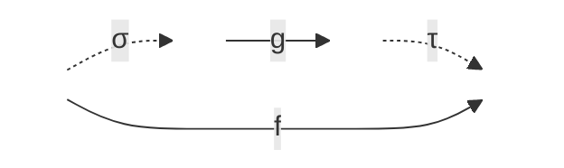
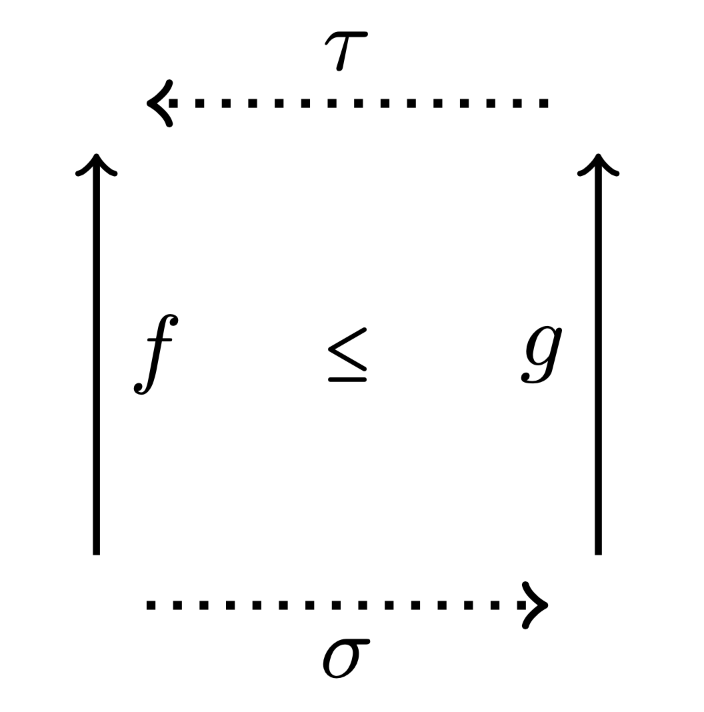
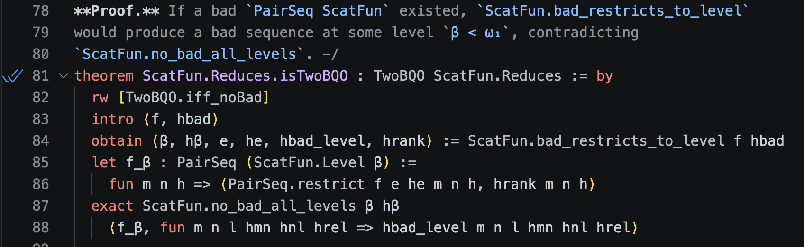

# Formal Verification of Well-Quasi-Orders of Continuous Functions


This repository contains the ongoing formal verification of mathematical results presented in the preprint **[A well-quasi-order for continuous functions](https://arxiv.org/abs/2410.13150)**, developed using **Lean 4**. 


## 🎯 Motivation: From Hilbert to AI Safety

The original motivation for formalizing the concept of a program (or algorithm) was to answer Hilbert's *Entscheidungsproblem* regarding the provability of mathematical statements. While this endeavor culminated in Gödel's incompleteness theorems—establishing fundamental limits on what algorithms can do regarding mathematical truth—it also yielded one of computer science's greatest triumphs: **while a program cannot prove every truth, it *can* definitively decide if a formalized reasoning is sound.**

Less than a century later, we are witnessing a paradigm shift. Data-driven approaches, trained on natural language—one of humanity's greatest achievements and an incredibly compressed way to model the world using a small vocabulary of tokens—have reached a level where they can help formalize mathematics, bridge gaps in proofs, and generate meaningful mathematical reasoning. It is a tremendously exciting time.

However, as AI models become increasingly complex and are deployed in ever-broader contexts, guaranteeing their reliability is paramount. We must ensure that the reasoning they output is fundamentally sound. Formal languages for mathematics, like **Lean 4**, implement a rigorous way to automatically verify reasoning.


At this critical intersection of AI and mathematics, formalized reasoning provides a unique and necessary pathway for verifying LLM outputs. To put this philosophy into practice, I am actively collaborating with frontier AI assistants—including **Claude Code**, **Gemini Pro**, and **Aristotle**—throughout this formalization exercise. By leveraging these models to accelerate the translation of mathematical intuition into Lean 4 code, I am directly exploring the synergistic loop between AI-generated reasoning and machine-verified soundness.

## 🧠 Mathematical Overview

A **well-quasi-ordering** (WQO) is a quasi-order where any infinite sequence of elements contains an increasing pair ($x_i \le x_j$ with $i < j$). This concept is ubiquitous in mathematics, fundamental in termination proofs and logic.

The paper formalized here deals with the following quasi-order on functions:

**Definition** A function `f : X → Y'` **continuously reduces** to `g : X' → Y'`, written `f ≤ g`, if there is a continuous `σ : X → X'` and a function `τ : Y' → Y` that is continuous on `im(g ∘ σ)`
such that `f(x) = τ(g(σ(x)))` for all `x` in `X`.



>Intuitively, `f` reduces to `g` if `g` can compute (or realize) `f` exactly, once you're allowed to continuously recode `f`'s inputs before feeding them to `g` (preprocessing `σ`), and   continuously recode `g`'s outputs back afterward (postprocessing `τ`).

<!---->

The main result states that this quasi-order is a WQO on a large class of functions

**Theorem (Main Result)** Continuous reducibility is a well-quasi-order on all continuous functions from a zero-dimensional separable metrizable space, as long as either the source space is analytic or the target space is countable.

>Continuous functions between these spaces come in bewildering variety, but our main theorem shows they're not chaotic: under continuous reducibility, you can never find infinitely many pairwise-incomparable functions, nor an infinite chain of strictly simpler and simpler ones. So despite the apparent complexity of the class, reducibility sorts it into a well-founded hierarchy — any large enough collection of functions must contain two that are comparable, and any attempt to keep reducing to something strictly simpler must terminate.

Because WQOs lack closure properties under infintary operations, this is achieved by proving a stronger property, that of better-quasi-ordering (BQO). 


## 🚀 Current Status

- [x] **Core Definitions:** Formalized the main concepts about functions and the notion of 2-BQO, an intermediate strengthening of WQO sufficient to carry out the proof.
- [x] **Preliminary Lemmas and intermediate Theorems:** Proved intermediate results concerning scattered functions and the Pointed Gluing operation, including the General Structure theorem and its corollaries.
- [x] **Standalone foundational libraries:** Extracted two Mathlib-only libraries that the main development builds on:
  - **`ZeroDimensionalSpaces`** — Baire/Cantor space basics, zero-dimensional spaces, the Cantor-scheme embedding machinery, and **Sierpiński universality** (`sierpinski_universal`: every countable metrizable space embeds into any nonempty perfect countable metrizable space). This is fully proved (`#print axioms` shows no `sorryAx`) and yields the universality of `CantorRat` used as the top element in Main Theorem 2.
  - **`BQO`** — better-quasi-order foundations (Ramsey theorems, 2-BQO closure properties, ordinal BQO).
- [x] **Centered functions (Chapter 4):** Now **fully formalized and `sorry`-free** — the consequences of the General Structure Theorem (every limit-rank function `≡ ℓ_λ`), the centered-as-pointed-gluing characterization (Thm 4.6), local centeredness from 2-BQO (Thm 4.7), finiteness of centered functions (Thm 4.9), and Corollary 4.10 (`centeredSuccessor`: up to equivalence the only centered functions at rank `λ+1` are `k_{λ+1}` and `pgl ℓ_λ`, for both `λ=1` and `λ` a nonzero limit), including the finite generation of `𝒞_{≤1}` (`LocallyConstantFunctions`).
- [~] **Main Theorems 1–3:** All three are stated and their full proof architecture is wired end-to-end (the scattered/non-scattered dichotomy, the WQO/BQO machinery, and the universality top elements). The single remaining structural input is `ScatFun.levels_finitely_generated` (finite generation of each CB-rank level), to be supplied by the Precise Structure and Double Successor chapters (Chapters 5–6). See [STRUCTURE.md](STRUCTURE.md) for the detailed proof tree.

### 🏆 Most Advanced Formally Verified Result

The screenshot below shows Lean 4's kernel accepting the proof of `ScatFun.Reduces.isTwoBQO`
— that continuous reducibility is a **2-BQO on scattered functions** — the central claim of
the project. It is fully proved up to the single remaining structural input
`ScatFun.levels_finitely_generated` (finite generation of each CB-rank level), the subject of
the Precise Structure and Double Successor chapters still to be formalized (the Centered
Functions chapter that precedes them is now complete):



**Fully verified, `sorry`-free results (Chapter 4 — centered functions).** The two theorems
below are the mathematical heart of the centered-functions chapter. Each is proved with **no
`sorry` anywhere in its dependency tree** — `#print axioms` lists only the three standard
axioms `propext`, `Classical.choice`, `Quot.sound`:

- **`localCenterednessFromTwoBQO_scatFun`** (Theorem 4.7) — for every `α < ω₁`, if the lower
  levels `𝒞_{<α}` are 2-BQO, then every scattered continuous function of CB-rank `α` is
  *locally centered*:

  ```lean
  theorem localCenterednessFromTwoBQO_scatFun
      (α : Ordinal.{0}) (hα : α < omega1)
      (hbqo : TwoBQO (ScatFun.LevelLT.reduces α)) :
      ∀ (F : ScatFun), CBRank F.func = α → IsLocallyCentered F.func
  ```

- **`finitenessOfCenteredFunctions`** (Theorem 4.9) — if `𝒞_{[λ, λ+n]}` is generated by a
  finite family `B`, then every *centered* function of rank in `[λ, λ+n+1]` is continuously
  equivalent either to the minimum function `k_{λ+1}` or to a pointed gluing of a non-empty
  sub-family of `B`:

  ```lean
  theorem finitenessOfCenteredFunctions
      {lam : Ordinal.{0}} (hlam : lam < omega1)
      (hlim : Order.IsSuccLimit lam ∨ lam = 0)
      {m n : ℕ} (B : Fin m → ScatFun)
      (hgen : ScatFun.LevelInter lam (lam + ↑n) ⊆ ScatFun.FinGl B)
      (g : ScatFun) (hg_lvl : g ∈ ScatFun.LevelInter lam (lam + ↑n + 1))
      (hg_cent : IsCentered g.func) :
      ScatFun.Equiv g (ScatFun.minFun lam hlam) ∨
        ∃ (k : ℕ) (ι : Fin k → Fin m), 0 < k ∧
          ScatFun.Equiv g (ScatFun.pgl (ScatFun.repSeq (B ∘ ι)))
  ```

  Its Corollary 4.10 (`centeredSuccessor`) is likewise `sorry`-free: up to continuous
  equivalence the only centered functions at rank `λ+1` are `k_{λ+1}` and `pgl ℓ_λ` (for both
  `λ = 1` and `λ` a nonzero limit).

## 🛠️ Building & Checking

This is a **Lean 4** project (Lean `v4.28.0`, with Mathlib pinned to `v4.28.0`). There is no
executable to run — *"running"* the development means having Lean's kernel **check** the
proofs, which is exactly what `lake build` does.

### Prerequisites

Install [`elan`](https://github.com/leanprover/elan), the Lean toolchain manager. It reads
`lean-toolchain` and fetches the correct Lean version automatically:

```bash
curl https://raw.githubusercontent.com/leanprover/elan/master/elan-init.sh -sSf | sh
```

### Build

```bash
git clone https://github.com/yannpequignot/lean-wqo-continuous-functions.git
cd lean-wqo-continuous-functions
lake exe cache get      # download the prebuilt Mathlib cache (do this first!)
lake build              # build & kernel-check the default target (WqoContinuousFunctions)
```

> ⚠️ **Run `lake exe cache get` before `lake build`.** This is by far the most common cause of
> a *"failed"* build: without the cache, `lake` tries to compile all of Mathlib from source,
> which takes hours and frequently exhausts memory. With the cache, a clean `lake build` of
> this development completes in a few minutes (it has been verified end-to-end on a fresh
> clone this way).

### Individual libraries and files

The package bundles three libraries; each can be built on its own:

```bash
lake build BQO                     # better-quasi-order foundations (Mathlib-only)
lake build ZeroDimensionalSpaces   # Baire/Cantor topology + Sierpiński universality (Mathlib-only)
lake build WqoContinuousFunctions  # the main development (default target)
```

You can also check a single module, e.g.

```bash
lake build WqoContinuousFunctions.CenteredFunctions.Finiteness
lake build WqoContinuousFunctions.MainResults.ScatFunBQO
```

A successful `lake build` means every proof in the target has been verified by Lean's kernel.
To audit that a specific result depends on no `sorry`, add `#print axioms <name>` to a file
(e.g. `#print axioms ScatFun.Reduces.isTwoBQO`); the output lists `sorryAx` iff a `sorry` is
reachable.

## 💻 Code Highlight

Here is a snippet demonstrating how the core property is elegantly formalized in Lean 4:

```lean
/--
A function `f` continuously reduces to `g` if there is a continuous `σ : X → X'`
and a function `τ : Y' → Y` that is continuous on `im(g ∘ σ)`
such that `f(x) = τ(g(σ(x)))` for all `x`.
-/
def ContinuouslyReduces {X Y X' Y' : Type*}
    [TopologicalSpace X] [TopologicalSpace Y]
    [TopologicalSpace X'] [TopologicalSpace Y']
    (f : X → Y) (g : X' → Y') : Prop :=
  ∃ σ : X → X', Continuous σ ∧
  ∃ τ : Y' → Y, ContinuousOn τ (Set.range (g ∘ σ)) ∧
    ∀ x : X, f x = τ (g (σ x))
    
/-- A function `f : X → Y` is *scattered* if every nonempty subset `S` of `X`
contains a nonempty relatively open subset on which `f` is constant.
-/
def ScatteredFun {X Y : Type*} [TopologicalSpace X] [TopologicalSpace Y]
    (f : X → Y) : Prop :=
  ∀ S : Set X, S.Nonempty → ∃ U : Set X, IsOpen U ∧ (U ∩ S).Nonempty ∧
    ∀ x ∈ U ∩ S, ∀ x' ∈ U ∩ S, f x = f x'
    
/-- Continuous reducibility is a well-quasi-order on scattered continuous functions
from a zero-dimensional separable metrizable space to a metrizable space.  Proved via
the stronger 2-BQO property of the associated `ScatFun` invariants. -/
theorem MainTheorem3
    (X : ℕ → Type*) (Y : ℕ → Type*)
    [∀ n, TopologicalSpace (X n)] [∀ n, TopologicalSpace (Y n)]
    [∀ n, SeparableSpace (X n)] [∀ n, MetrizableSpace (X n)]
    [∀ n, ZeroDimensionalSpace (X n)]
    [∀ n, MetrizableSpace (Y n)]
    (f : ∀ n, X n → Y n) (hf : ∀ n, Continuous (f n))
    (hsc : ∀ n, ScatteredFun (f n)) :
    ∃ m n : ℕ, m < n ∧ ContinuouslyReduces_range_based (f m) (f n) := by
  ...

```
## 📄 References
This formalization is a direct implementation of the mathematical research presented in the following articles:

1. **[Raphaël Carroy, Yann Pequignot] (2024).** *"[A well-quasi-order for continuous functions]"*. arXiv:2410.13150.  
   [Read the paper on arXiv](https://arxiv.org/abs/2410.13150)

2. **[Yann Pequignot] (2017).** *"[Towards better: A motivated introduction to better-quasi-orders]"*. EMS Surveys in Mathematical Sciences.  
   [Read the article on EMS Press](https://ems.press/journals/emss/articles/15096)
