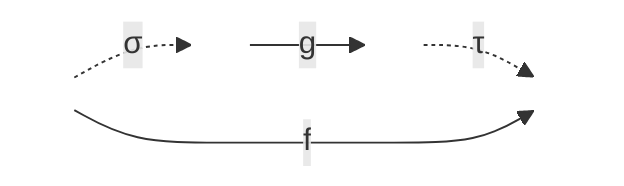

# Formal Verification of Well-Quasi-Orders of Continuous Functions


This repository contains the ongoing formal verification of mathematical results presented in the preprint **[A well-quasi-order for continuous functions](https://arxiv.org/abs/2410.13150)**, developed using **Lean 4**. 


## 🎯 Motivation: From Hilbert to AI Safety

The original motivation for formalizing the concept of a program (or algorithm) was to answer Hilbert's *Entscheidungsproblem* regarding the provability of mathematical statements. While this endeavor culminated in Gödel's incompleteness theorems—establishing fundamental limits on what algorithms can do regarding mathematical truth—it also yielded one of computer science's greatest triumphs: **while a program cannot prove every truth, it *can* definitively decide if a formalized reasoning is sound.**

Less than a century later, we are witnessing a paradigm shift. Data-driven approaches, trained on natural language—one of humanity's greatest achievements and an incredibly compressed way to model the world using a small vocabulary of tokens—have reached a level where they can help formalize mathematics, bridge gaps in proofs, and generate meaningful mathematical reasoning. It is a tremendously exciting time.

However, as AI models become increasingly complex and are deployed in ever-broader contexts, guaranteeing their reliability is paramount. We must ensure that the reasoning they output is fundamentally sound. Formal languages for mathematics, like **Lean 4**, implement a rigorous way to automatically verify reasoning.


At this critical intersection of AI and mathematics, formalized reasoning provides a unique and necessary pathway for verifying LLM outputs. To put this philosophy into practice, I am actively collaborating with frontier AI assistants—including **Claude Code**, **Gemini Pro**, and **Aristotle**—throughout this formalization exercise. By leveraging these models to accelerate the translation of mathematical intuition into Lean 4 code, I am directly exploring the synergistic loop between AI-generated reasoning and machine-verified soundness.

## 🧠 Mathematical Overview

A **well-quasi-ordering** (WQO) is a quasi-order where any infinite sequence of elements contains an increasing pair ($x_i \le x_j$ with $i < j$). This concept is ubiquitous in mathematics, fundamental in termination proofs and logic.

The paper formalized here deals with the following quasi-order on functions:

**Definition** A function `f : X → Y'` **continuously reduces** to `g : X' → Y'`, written `f ≤ g`, if there is a continuous `σ : X → X'` and a function `τ : Y' → Y` that is continuous on `im(g ∘ σ)`
such that `f(x) = τ(g(σ(x)))` for all `x` in `X`.



<!---->

The main result states that this quasi-order is a WQO on a large class of functions

**Theorem (Main Theorem 3)** Continuous reducibility is a well-quasi-order on the class of scattered continuous functions from a zero-dimensional separable metrizable space to a metrizable space.

Because WQOs lack closure properties under infintary operations, this is achieved by proving a stronger property, that of better-quasi-ordering (BQO). 


## 🚀 Current Status

- [x] **Core Definitions:** Formalized main concepts about functions and the concept of 2-BQO an intermediate strengthening of WQO which I believe to be enough to carry out the proof.
- [x] **Preliminary Lemmas and intermediate Theorems:** Proved intermediate results concerning Scattered functions and the Pointed Gluing operation.
- [ ] **Main Theorem:** A major step has been already formally proved with the General Structure theorem and its corollaries (more information in ). 

## 💻 Code Highlight

Here is a snippet demonstrating how the core property is elegantly formalized in Lean 4:

```lean
/--
A function `f` continuously reduces to `g` if there is a continuous `σ : X → X'`
and a function `τ : Y' → Y` that is continuous on `im(g ∘ σ)`
such that `f(x) = τ(g(σ(x)))` for all `x`.
-/
def ContinuouslyReduces {X Y X' Y' : Type*}
    [TopologicalSpace X] [TopologicalSpace Y]
    [TopologicalSpace X'] [TopologicalSpace Y']
    (f : X → Y) (g : X' → Y') : Prop :=
  ∃ σ : X → X', Continuous σ ∧
  ∃ τ : Y' → Y, ContinuousOn τ (Set.range (g ∘ σ)) ∧
    ∀ x : X, f x = τ (g (σ x))
    
/-- A function `f : X → Y` is *scattered* if every nonempty subset `S` of `X`
contains a nonempty relatively open subset on which `f` is constant.
-/
def ScatteredFun {X Y : Type*} [TopologicalSpace X] [TopologicalSpace Y]
    (f : X → Y) : Prop :=
  ∀ S : Set X, S.Nonempty → ∃ U : Set X, IsOpen U ∧ (U ∩ S).Nonempty ∧
    ∀ x ∈ U ∩ S, ∀ x' ∈ U ∩ S, f x = f x'
    
theorem MainTheorem3
    (X : ℕ → Type*) (Y : ℕ → Type*)
    [∀ n, TopologicalSpace (X n)] [∀ n, TopologicalSpace (Y n)]
    [∀ n, SeparableSpace (X n)] [∀ n, MetrizableSpace (X n)]
    [∀ n, TotallyDisconnectedSpace (X n)]
    [∀ n, MetrizableSpace (Y n)]
    (f : ∀ n, X n → Y n) (hf : ∀ n, Continuous (f n))
    (hsc : ∀ n, ScatteredFun (f n)) :
    ∃ m n : ℕ, m < n ∧ ContinuouslyReduces (f m) (f n) := by
  sorry

```
## 📄 References
This formalization is a direct implementation of the mathematical research presented in my published papers:

1. **[Raphaël Carroy, Yann Pequignot] (2024).** *"[A well-quasi-order for continuous functions]"*. arXiv:2410.13150.  
   [Read the paper on arXiv](https://arxiv.org/abs/2410.13150)

2. **[Yann Pequignot] (2017).** *"[Towards better: A motivated introduction to better-quasi-orders]"*. EMS Surveys in Mathematical Sciences.  
   [Read the article on EMS Press](https://ems.press/journals/emss/articles/15096)
