# Repository Structure and Proof Tree for Main Theorem 3

**Project:** `WqoContinuousFunctions` (Lean 4 + Mathlib v4.28.0)  
**Goal:** Formalize the memoir on continuous reducibility of continuous functions,
with Main Theorem 3 as the primary target.

---

## 1. Repository Layout

```mermaid
treeView-beta
  "📁 wqo_functions/"
    "📄 lakefile.toml - lake build configuration"
    "📁 WqoContinuousFunctions/"
      "📄 Main.lean - top-level entry point (re-exports)"
      "📁 MainResults/"
        "📄 Main.lean - statements of Thm 1–3 (all sorry)"
        "📄 ScatFunBQO.lean - Main Theorem 3 proved (see §3)"
      "📁 BaireSpace/"
        "📄 Basics.lean - Baire space topology, cylinder sets, clopen basis"
        "📄 GenRedProp.lean - disjointification of open families"
      "📁 BQO/"
        "📄 Ramsey.lean - RT² and RT³ for ℕ (finite colorings)"
        "📄 TwoBQO.lean - 2-BQO definition, closure under products and lex sums"
        "📄 OrdinalBQO.lean - ≤• on ordinals is 2-BQO; ordinal arithmetic helpers"
      "📁 ContinuousReducibility/"
        "📄 Defs.lean - ContinuouslyReduces, ScatteredFun, CBRank (core defs)"
        "📄 Scattered.lean - re-export of Scattered/*"
        "📁 Scattered/"
          "📄 CBAnalysis.lean - CB derivative, CB rank, scattered ↔ empty kernel"
          "📄 NonScattered.lean - non-scattered ⟹ ℚ embeds (Thm 2.5) — fully proved"
          "📄 Decomposition.lean - locally simple decomposition (Lem 2.15)"
        "📄 Gluing.lean - re-export of Gluing/*"
        "📁 Gluing/"
          "📄 Defs.lean - GluingSet, GluingFunVal, clopen partitions"
          "📄 LocallyConstant.lean - locally constant ≡ id_ℕ or id_Unit"
          "📄 UpperBound.lean - f ≤ ⊔ᵢ gᵢ ↔ clopen partition with f|Aᵢ ≤ gᵢ"
      "📁 PointedGluing/"
        "📄 Defs.lean - PointedGluingSet/Fun, MaxDom/MinDom, MaxFun/MinFun"
        "📄 GeneralStructure.lean - ★ General Structure Theorem (Thm 3.13) — fully proved"
        "📄 SelfSimilarity.lean - GluingSet(MaxDom α) ≤ MaxFun α — fully proved"
        "📄 LowerBoundLemma.lean - pointed gluing as lower bound (Lem 3.13) — fully proved"
        "📄 ClopenPartitionReduces.lean - locally reduces ⟹ globally reduces"
        "📁 Basics/"
          "📄 Properties.lean - continuity/injectivity of pgl; CBRank of pgl"
          "📄 Functoriality.lean - pgl functoriality; ω·pgl ≤ pgl(pgl)"
          "📄 GluingInjection.lean - gluing ≤ pointed-gluing via injection"
          "📄 ContinuousOnTau.lean - ContinuousOn for τ at zeroStream"
        "📁 CBRank/"
          "📄 Helpers.lean - CB levels of blocks in pgl; zeroStream in CB levels"
          "📄 SimpleHelpers.lean - ray CB ranks, regularity lemmas"
          "📄 RegularSimple.lean - CBrank_regular_simple (Prop 3.8)"
        "📁 MinFun/"
          "📄 Helpers.lean - basic properties of MinFun"
          "📄 LocalHelpers.lean - local conditions for MinFun"
          "📄 LowerBound.lean - MinFun is a lower bound"
          "📄 Theorems.lean - pointedGluing_lower_bound; minFun_is_minimum"
        "📁 MaxFun/"
          "📄 Helpers.lean - basic properties of MaxFun"
          "📄 Maximum.lean - MaxFun is maximum at its CB rank"
          "📁 LimitRankHelpers/"
            "📄 Helpers.lean - limit rank helpers"
            "📄 ClopenRestriction.lean - clopen restriction at limit rank"
            "📄 TreeArgument.lean - tree argument for limit rank"
        "📁 UpperBound/"
          "📄 Helpers.lean - upper bound helpers"
          "📄 Theorem.lean - pointedGluing_upper_bound (Prop 3.5)"
      "📁 ScatFun/"
        "📄 Defs.lean - ScatFun type, Level/LevelLE/LevelLT subtypes"
        "📄 LiftToLex.lean - bad sequence in ScatFun ⟹ bad in lex sum"
        "📄 ReflectLevel.lean - bad_restricts_to_level ✓; Level.no_bad ✗ (sorry)"
      "📁 CenteredFunctions/"
        "📄 Defs.lean - IsCenterFor, IsCentered, IsLocallyCentered, RayFun"
        "📄 Helpers.lean - helpers for centered function theorems (mostly proved)"
        "📄 Theorems.lean - centered classification theorems (mostly sorry)"
      "📁 PreciseStructure/"
        "📄 Defs.lean - definitions for the Precise Structure Theorem"
        "📄 Theorems.lean - Precise Structure Theorem (nearly all sorry)"
      "📁 DoubleSuccessor/"
        "📄 Defs.lean - double-successor case definitions"
        "📄 Theorems.lean - double-successor theorems (all sorry)"
```




> **Note.** The `.claude/worktrees/` directory contains leftover git worktrees from
> automated editing sessions. It is not part of the mathematical content.

---

## 2. Module Dependency Graph

The following diagram shows the logical import order from foundations to the main result.

```mermaid
flowchart LR
    MB((Mathlib v4.28.0))
    MB --> BSB[BaireSpace/Basics]

    BSB --> CRD[ContinuousReducibility/Defs]
    CRD --> BSGRP[BaireSpace/GenRedProp]
    CRD --> GD[Gluing/Defs]
    CRD --> SCBA[Scattered/CBAnalysis]

    GD --> GLC[Gluing/LocallyConstant]
    GD --> GUB[Gluing/UpperBound]

    SCBA --> SNS[Scattered/NonScattered]
    SCBA --> SD[Scattered/Decomposition]

    BQOR[BQO/Ramsey] --> BQO2[BQO/TwoBQO]
    BQO2 --> BQOO[BQO/OrdinalBQO]

    BQOO --> PGD[PointedGluing/Defs]
    BSB --> PGD

    PGD --> MF[MinFun/*]
    PGD --> CBR[CBRank/*]
    PGD --> BP[Basics/Properties]
    PGD --> MAXF[MaxFun/*]
    PGD --> SS[SelfSimilarity]
    PGD --> LBL[LowerBoundLemma]
    PGD --> UB[UpperBound/*]
    PGD --> CPR[ClopenPartitionReduces]
    PGD --> GS[GeneralStructure]

    MF --> MFT[MinFun/Theorems]

    CBR --> CBRS[CBRank/RegularSimple]

    BP --> BF[Basics/Functoriality]
    BP --> BGI[Basics/GluingInjection]
    BGI --> BCT[Basics/ContinuousOnTau]

    MAXF --> MAXFM[MaxFun/Maximum]
    MAXF --> MAXFLRH[MaxFun/LimitRankHelpers/*]

    BGI --> GS
    BQOO --> GS

    GS --> SFD[ScatFun/Defs]
    SFD --> SFTL[ScatFun/LiftToLex]
    SFTL --> SFRL[ScatFun/ReflectLevel]
    SFRL --> MRSFB[MainResults/ScatFunBQO]
    MRSFB --> MAIN([Main.lean])

    style MB fill:#534AB7,color:#EEEDFE,stroke:#3C3489
    style BSB fill:#185FA5,color:#E6F1FB,stroke:#0C447C
    style CRD fill:#185FA5,color:#E6F1FB,stroke:#0C447C
    style BSGRP fill:#0C447C,color:#E6F1FB,stroke:#042C53
    style GD fill:#0C447C,color:#E6F1FB,stroke:#042C53
    style GLC fill:#085041,color:#E1F5EE,stroke:#04342C
    style GUB fill:#085041,color:#E1F5EE,stroke:#04342C
    style SCBA fill:#0C447C,color:#E6F1FB,stroke:#042C53
    style SNS fill:#085041,color:#E1F5EE,stroke:#04342C
    style SD fill:#085041,color:#E1F5EE,stroke:#04342C
    style BQOR fill:#BA7517,color:#FAEEDA,stroke:#854F0B
    style BQO2 fill:#BA7517,color:#FAEEDA,stroke:#854F0B
    style BQOO fill:#BA7517,color:#FAEEDA,stroke:#854F0B
    style PGD fill:#993C1D,color:#FAECE7,stroke:#712B13
    style MF fill:#993C1D,color:#FAECE7,stroke:#712B13
    style MFT fill:#712B13,color:#FAECE7,stroke:#4A1B0C
    style CBR fill:#993C1D,color:#FAECE7,stroke:#712B13
    style CBRS fill:#712B13,color:#FAECE7,stroke:#4A1B0C
    style BP fill:#993556,color:#FBEAF0,stroke:#72243E
    style BF fill:#72243E,color:#FBEAF0,stroke:#4B1528
    style BGI fill:#72243E,color:#FBEAF0,stroke:#4B1528
    style BCT fill:#4B1528,color:#FBEAF0,stroke:#4B1528
    style MAXF fill:#993C1D,color:#FAECE7,stroke:#712B13
    style MAXFM fill:#712B13,color:#FAECE7,stroke:#4A1B0C
    style MAXFLRH fill:#712B13,color:#FAECE7,stroke:#4A1B0C
    style SS fill:#444441,color:#F1EFE8,stroke:#2C2C2A
    style LBL fill:#444441,color:#F1EFE8,stroke:#2C2C2A
    style UB fill:#444441,color:#F1EFE8,stroke:#2C2C2A
    style CPR fill:#444441,color:#F1EFE8,stroke:#2C2C2A
    style GS fill:#444441,color:#F1EFE8,stroke:#2C2C2A
    style SFD fill:#3C3489,color:#EEEDFE,stroke:#26215C
    style SFTL fill:#3C3489,color:#EEEDFE,stroke:#26215C
    style SFRL fill:#3C3489,color:#EEEDFE,stroke:#26215C
    style MRSFB fill:#534AB7,color:#EEEDFE,stroke:#3C3489
    style MAIN fill:#534AB7,color:#EEEDFE,stroke:#3C3489
```


<!--```
Mathlib (v4.28.0)
     │
     ▼
BaireSpace/Basics ───────────────────────────────────────┐
     │                                                   │
     ▼                                                   │
ContinuousReducibility/Defs                              │
     │                                                   │
     ├──▶ BaireSpace/GenRedProp                          │
     │                                                   │
     ├──▶ Gluing/Defs ──▶ Gluing/LocallyConstant         │
     │         └──────▶ Gluing/UpperBound                │
     │                                                   │
     └──▶ Scattered/CBAnalysis ──▶ Scattered/NonScattered│
               └────────────────▶ Scattered/Decomposition│
                                                         │
BQO/Ramsey ──▶ BQO/TwoBQO ──▶ BQO/OrdinalBQO             │
                                    │                    │
                    ┌───────────────┘                    │
                    │                                    │
                    ▼                                    ▼
             PointedGluing/Defs ◀──────────────── (all import BaireSpace/Basics)
                    │
                    ├──▶ MinFun/* ──▶ MinFun/Theorems
                    │
                    ├──▶ CBRank/* ──▶ CBRank/RegularSimple
                    │
                    ├──▶ Basics/Properties ──▶ Basics/Functoriality
                    │         └────────────▶ Basics/GluingInjection ──▶ Basics/ContinuousOnTau
                    │
                    ├──▶ MaxFun/* ──▶ MaxFun/Maximum
                    │       └──────▶ MaxFun/LimitRankHelpers/*
                    │
                    ├──▶ SelfSimilarity
                    ├──▶ LowerBoundLemma
                    ├──▶ UpperBound/*
                    ├──▶ ClopenPartitionReduces
                    └──▶ GeneralStructure  ◀── (imports GluingInjection + OrdinalBQO)
                                │
                                ▼
                    ScatFun/Defs ──▶ ScatFun/LiftToLex ──▶ ScatFun/ReflectLevel
                                                                     │
                                                                     ▼
                                                           MainResults/ScatFunBQO
                                                                     │
                                                                     ▼
                                                               Main.lean
```
-->
---

## 3. Proof Tree for Main Theorem 3

**Statement** (`MainResults/ScatFunBQO.lean`):

> **Theorem 3 (WQO).** Continuous reducibility is a well-quasi-order on
> `ScatFun` — scattered continuous functions from subsets of Baire space to Baire space.

```
ScatFun.Reduces.isWQO                                         [PROVED, modulo sorries below]
  ↓ via TwoBQO.wellQuasiOrdered
ScatFun.Reduces.isTwoBQO                                      [PROVED, modulo sorries below]
  ↓ via TwoBQO.iff_noBad
¬ ∃ bad pair-sequence in (ScatFun, ScatFun.Reduces)
```

This "no bad sequence" claim is split into two independent pillars:

### Pillar A — Concentration on a single CB-rank level

```
ScatFun.bad_restricts_to_level                                [PROVED ✓]
  "Any bad pair-sequence has a subsequence concentrated on one CB-rank level β < ω₁"
  │
  ├── ScatFun.liftToLex_bad                                   [PROVED ✓]
  │     "Bad seq in ScatFun ⟹ bad in lex sum Σ β, Level β with order ≤•"
  │     └── general_structure_theorem  (PointedGluing/GeneralStructure.lean) [PROVED ✓]
  │           "Two-part structure: same limit base ⟹ reduces; rank gap ⟹ reduces"
  │           Uses the entire PointedGluing/* machinery (all fully proved).
  │
  └── TwoBQO.lexSigmaQO_reflect                               [PROVED ✓]
        "Bad seq in lex sum Σᵣ α, Tα ⟹ concentrated on one fiber, or bad in the index r"
        Uses Ordinal.leBullet.isTwoBQO: (Ordinal.{0}, ≤•) is 2-BQO     [PROVED ✓]
```

### Pillar B — No bad sequence at any single CB-rank level

```
ScatFun.no_bad_all_levels                                     [PROVED ✓, uses sorry below]
  "∀ β < ω₁, the level ScatFun.Level β has no bad pair-sequence"
  ↓ by transfinite induction on β
ScatFun.Level.no_bad  (β : Ordinal, β < ω₁)                  [★ SORRY ★]
  "If all levels < β are 2-BQO, then level β is 2-BQO"
  │
  This is the key missing step. The intended mathematical proof is:
  │
  ├── Finite Generation Theorem (PreciseStructure/Theorems.lean)  [SORRY]
  │     "Every function in Level β is continuously equivalent to a
  │      finite gluing of finitely many generators (MaxFun and centered functions)"
  │     │
  │     ├── Precise Structure Theorem                              [SORRY]
  │     │     Uses: CenteredFunctions/Theorems + DoubleSuccessor/Theorems
  │     │
  │     ├── CenteredFunctions/Theorems.lean                        [MOSTLY SORRY]
  │     │     "centeredSuccessor, simpleFunctionsLambdaPlusOne, ..."
  │     │     partial prerequisites: Helpers.lean (mostly proved)
  │     │
  │     └── DoubleSuccessor/Theorems.lean                          [ALL SORRY]
  │           "vertical_theorem, diagonal_theorem, solvable_decomposition, ..."
  │
  └── TwoBQO.prod / TwoBQO.pi (Dickson's lemma for 2-BQO)        [PROVED ✓]
        "Finite products of 2-BQOs are 2-BQO"
        Used to combine finitely many generator-level 2-BQO facts.
```

### Summary: What is proved vs. open

| Component | Status | File |
|---|---|---|
| Baire space topology | ✓ fully proved | `BaireSpace/Basics.lean` |
| Core reducibility defs | ✓ fully proved | `ContinuousReducibility/Defs.lean` |
| CB analysis (CB rank, CB derivative) | ✓ mostly proved | `Scattered/CBAnalysis.lean` |
| `CBRank_lt_omega1` | ✗ sorry | `Scattered/CBAnalysis.lean` |
| `scattered_imp_locallyConstantLocus_univ` | ✗ sorry | `Scattered/CBAnalysis.lean` |
| Non-scattered ⟹ ℚ embeds (Thm 2.5) | ✓ fully proved | `Scattered/NonScattered.lean` |
| Locally-simple decomposition (Lem 2.15) | ✓ fully proved | `Scattered/Decomposition.lean` |
| First Reduction Theorem (Thm 2.12) | ✗ sorry | `Scattered/Decomposition.lean` |
| Gluing upper/lower bound | ✓ fully proved | `Gluing/*` |
| Ramsey RT² and RT³ | ✓ fully proved | `BQO/Ramsey.lean` |
| 2-BQO framework (products, lex sums) | ✓ fully proved | `BQO/TwoBQO.lean` |
| (Ordinal, ≤•) is 2-BQO | ✓ fully proved | `BQO/OrdinalBQO.lean` |
| Pointed gluing (pgl) machinery | ✓ fully proved | `PointedGluing/Basics/*` |
| MinFun is minimum; MaxFun is maximum | ✓ fully proved | `PointedGluing/Min/MaxFun/*` |
| Upper / lower bound propositions | ✓ fully proved | `PointedGluing/UpperBound/*` + `LowerBoundLemma.lean` |
| Self-similarity of MaxFun | ✓ fully proved | `PointedGluing/SelfSimilarity.lean` |
| **General Structure Theorem** | ✓ **fully proved** | `PointedGluing/GeneralStructure.lean` |
| ScatFun type definitions | ✓ fully proved | `ScatFun/Defs.lean` |
| Lift bad seq to lex sum | ✓ fully proved | `ScatFun/LiftToLex.lean` |
| Bad seq concentrates on one level | ✓ fully proved | `ScatFun/ReflectLevel.lean` |
| **`Level.no_bad`** (inductive step) | ✗ **sorry** | `ScatFun/ReflectLevel.lean` |
| CenteredFunctions helpers | ✓ mostly proved | `CenteredFunctions/Helpers.lean` |
| CenteredFunctions theorems | ✗ mostly sorry | `CenteredFunctions/Theorems.lean` |
| PreciseStructure definitions | ✓ fully proved | `PreciseStructure/Defs.lean` |
| Finite Generation / Precise Structure | ✗ all sorry | `PreciseStructure/Theorems.lean` |
| Double Successor theorems | ✗ all sorry | `DoubleSuccessor/Theorems.lean` |
| **Main Theorem 3 (WQO conclusion)** | ✓ proved modulo above | `MainResults/ScatFunBQO.lean` |

---

## 4. Key Definitions

### Continuous reducibility

```lean
-- f : A → B reduces to g : C → D if there exist continuous σ : A → C and
-- τ : range(g ∘ σ) → B with f = τ ∘ g ∘ σ on the appropriate subsets.
def ContinuouslyReduces (f : A → B) (g : C → D) : Prop := ...
```

### Scattered functions and CB rank

```lean
-- f is scattered if every nonempty set has a piece on which f is constant.
def ScatteredFun (f : A → B) : Prop := ...

-- Cantor–Bendixson derivative: transfinite sequence of sets
noncomputable def CBLevel (f : A → B) : Ordinal → Set A := ...

-- CB rank: first ordinal where the derivative empties out
noncomputable def CBRank (f : A → B) : Ordinal := ...
```

### ScatFun (the 2-BQO universe)

```lean
-- A scattered continuous function on (subsets of) Baire space ℕ → ℕ.
structure ScatFun where
  domain : Set Baire
  func   : ↑domain → Baire
  hScat  : ScatteredFun func
  hCont  : Continuous func

-- Level-β fragment: functions with CB rank exactly β.
def ScatFun.Level (β : Ordinal) : Type := { F : ScatFun // CBRank F.func = β }
```

### Pointed gluing

```lean
-- PointedGluingSet Aᵢ = {0^ω} ∪ ⋃ᵢ (0^i)(1) · Aᵢ
def PointedGluingSet (A : ℕ → Set (ℕ → ℕ)) : Set (ℕ → ℕ) := ...

-- PointedGluingFun: maps (0^i)(1)·x to (0^i)(1)·fᵢ(x) and 0^ω to 0^ω.
noncomputable def PointedGluingFun (...) : PointedGluingSet A → ℕ → ℕ := ...

-- MaxFun(α) and MinFun(α): the maximum and minimum scattered functions at CB rank α.
noncomputable def MaxFun : Ordinal → (MaxDom α → ℕ → ℕ) := ...
noncomputable def MinFun : Ordinal → (MinDom α → ℕ → ℕ) := ...
```

### 2-BQO

```lean
-- A pair-sequence is bad if no earlier element reduces to a later one.
def PairSeq.IsBad (r : α → α → Prop) (f : PairSeq α) : Prop :=
  ∀ m n (h : m < n), ¬ r (f m n h) (f n ... )

-- (α, r) is 2-BQO if every pair-sequence has a "good" sub-pair-sequence.
def TwoBQO (r : α → α → Prop) : Prop := ∀ f : PairSeq α, ¬ IsBad r f
```

---

## 5. The Road Ahead

The single blocking sorry for Main Theorem 3 is:

```lean
theorem ScatFun.Level.no_bad (β : Ordinal) (hβ : β < omega1)
    (ih : ∀ γ < β, ¬ ∃ bad in Level γ) :
    ¬ ∃ bad in Level β := by
  sorry
```

Filling this requires three chapters of mathematical work:

1. **Centered functions** (`CenteredFunctions/Theorems.lean`):
   - `IsCentered f`: the function `f` is centered — it is a pointed gluing of its ray functions.
   - Key theorems to prove: `centeredSuccessor` (centered functions at successor ranks are
     gluings of centered functions at lower ranks), `simpleFunctionsLambdaPlusOne`
     (classification of simple functions at level λ+1).

2. **Precise Structure Theorem** (`PreciseStructure/Theorems.lean`):
   - Every function at level β is continuously equivalent to a finite gluing of
     `MaxFun(β)` and finitely many "centered" generator functions.
   - This requires the double-successor case (`DoubleSuccessor/Theorems.lean`):
     the vertical and diagonal theorems showing that functions at level α+2 decompose
     via a "gobbling" argument.

3. **From finite generation to BQO** (`ScatFun/ReflectLevel.lean`):
   - Once Level β is finitely generated, `Level β` injects into a finite product
     of 2-BQOs (the generators at lower levels, which are 2-BQO by induction).
   - `TwoBQO.prod` (Dickson's lemma) then gives the 2-BQO conclusion.
