# Repository Structure and Proof Tree for Main Theorem 3

**Project:** four Lean 4 libraries in one package (Mathlib v4.28.0) — the Mathlib-only
foundations `ZeroDimensionalSpaces`, `BQO`, and `GeneralTopology`, and the main development
`WqoContinuousFunctions`  
**Goal:** Formalize the memoir on continuous reducibility of continuous functions,
with Main Theorem 3 as the primary target.

**Main achievements** (all in `MainResults/`, all fully proved and `sorry`-free):

* `MainTheorem1` / `MainTheorem2` / `MainTheorem3` — continuous reducibility is a WQO on the
  three classes of the introduction (`MainResults/Main.lean`); Main Theorem 3 rests on
  `ScatFun.levels_finitely_generated`, which is fully proved (its §6.4 solvable-functions
  input lives in `DoubleSuccessor/Solvable.lean`).
* `first_reduction_theorem` (Thm 2.12) — the trichotomy: a continuous `f : X → Y` (zero-dim
  sep. metrizable `X`, metrizable `Y`, `PolishSpace X ∨ Countable Y`) is scattered,
  `≡ id_CantorRat`, or `≡ id_CantorSpace` (`MainResults/Main.lean`, fully proved).
* `ZeroDimContFun.Reduces.isTwoBQO` — the **whole admissible class** (bundled as
  `ZeroDimContFun`, ordered by the image-based `ContinuouslyReduces_range_based`) is 2-BQO,
  obtained from the trichotomy + the `ScatFun` 2-BQO (`MainResults/Main.lean`, fully proved).

---

## 1. Repository Layout

```mermaid
treeView-beta
  "📁 wqo_functions/"
    "📄 lakefile.toml - four libraries in one package (Mathlib required once)"
    "📁 ZeroDimensionalSpaces/ — standalone Mathlib-only library"
      "📄 Basics.lean - Baire/Cantor topology, clopen basis, ZeroDimensionalSpace, embeds-in-Baire"
      "📄 GenRedProp.lean - disjointification of open families in Baire subspaces"
      "📄 CantorRat.lean - CantorRat (eventually-zero sequences): metrizable, countable, perfect"
      "📄 Engine.lean - clopen-ball / clopen-split engine for the back-and-forth"
      "📄 CantorScheme.lean - Cantor scheme ⟹ CantorRat embedding machinery"
      "📄 CantorSchemeComplete.lean - full scheme over a complete carrier (2^ℕ embedding)"
      "📄 SierpinskiForth.lean - every countable metrizable space ↪ CantorRat (forth direction)"
      "📄 SierpinskiAux.lean - CantorRat ↪ any nonempty perfect countable metrizable space"
      "📄 Universality.lean - ★ sierpinski_universal (proved, no sorry); countable_metrizable_embeds_cantorRat"
    "📁 BQO/ — standalone Mathlib-only library"
      "📄 Ramsey.lean - RT² and RT³ for ℕ (finite colorings)"
      "📄 TwoBQO.lean - 2-BQO definition, closure under products and lex sums"
      "📄 OrdinalBQO.lean - ≤• on ordinals is 2-BQO; ordinal arithmetic helpers"
    "📁 GeneralTopology/ — standalone Mathlib-only library (general point-set topology)"
      "📄 ClopenPartitions.lean - set algebra for countable clopen partitions"
      "📄 DiscreteSubspaces.lean - pairwise-disjoint infinite discrete subspaces"
      "📄 DisjointOpenNeighbourhoods.lean - disjoint open nbhds of a discrete subspace"
    "📁 WqoContinuousFunctions/ — main development"
      "📄 Main.lean - top-level entry point (re-exports)"
      "📁 MainResults/ — ★ the main achievements of the project"
        "📄 Main.lean - Main Theorems 1–3 + first_reduction_theorem (Thm 2.12) + ZeroDimContFun.Reduces.isTwoBQO (the whole admissible class is 2-BQO)"
        "📄 ScatFunBQO.lean - ScatFun is 2-BQO ⟹ Main Theorem 3 (see §3)"
        "📄 ScatFunRepresentation.lean - main3_to_ScatFun: a scattered continuous function is ≡ some ScatFun"
      "📁 ContinuousReducibility/"
        "📄 Defs.lean - ContinuouslyReduces, ScatteredFun, CBRank (core defs)"
        "📄 Universality.lean - reducibility universality (CantorRat top for Thm 2, via ZeroDimensionalSpaces)"
        "📄 Scattered.lean - re-export of Scattered/*"
        "📁 Scattered/"
          "📄 CBAnalysis.lean - CB derivative, CB rank, scattered ↔ empty kernel"
          "📄 NonScattered.lean - non-scattered ⟹ CantorRat (Thm 2) / 2^ℕ (Thm 1) embeds — fully proved"
          "📄 Decomposition.lean - locally simple decomposition (Lem 2.15)"
        "📄 Gluing.lean - re-export of Gluing/*"
        "📁 Gluing/"
          "📄 Defs.lean - GluingSet, GluingFunVal, clopen partitions"
          "📄 LocallyConstant.lean - locally constant ≡ id_ℕ or id_Unit"
          "📄 UpperBound.lean - f ≤ ⊔ᵢ gᵢ ↔ clopen partition with f|Aᵢ ≤ gᵢ"
      "📁 PointedGluing/"
        "📄 Defs.lean - PointedGluingSet/Fun, MaxDom/MinDom, MaxFun/MinFun"
        "📄 GeneralStructure.lean - ★ General Structure Theorem (Thm 3.13) — fully proved"
        "📄 SelfSimilarity.lean - GluingSet(MaxDom α) ≤ MaxFun α — fully proved"
        "📄 LowerBoundLemma.lean - pointed gluing as lower bound (Lem 3.13) — fully proved"
        "📄 ClopenPartitionReduces.lean - locally reduces ⟹ globally reduces"
        "📁 Basics/"
          "📄 Properties.lean - continuity/injectivity of pgl; CBRank of pgl"
          "📄 Functoriality.lean - pgl functoriality; ω·pgl ≤ pgl(pgl)"
          "📄 GluingInjection.lean - gluing ≤ pointed-gluing via injection"
          "📄 ContinuousOnTau.lean - ContinuousOn for τ at zeroStream"
        "📁 CBRank/"
          "📄 Helpers.lean - CB levels of blocks in pgl; zeroStream in CB levels"
          "📄 SimpleHelpers.lean - ray CB ranks, regularity lemmas"
          "📄 RegularSimple.lean - CBrank_regular_simple (Prop 3.8)"
        "📁 MinFun/"
          "📄 Helpers.lean - basic properties of MinFun"
          "📄 LocalHelpers.lean - local conditions for MinFun"
          "📄 LowerBound.lean - MinFun is a lower bound"
          "📄 Theorems.lean - pointedGluing_lower_bound; minFun_is_minimum"
        "📁 MaxFun/"
          "📄 Helpers.lean - basic properties of MaxFun"
          "📄 Maximum.lean - MaxFun is maximum at its CB rank"
          "📁 LimitRankHelpers/"
            "📄 Helpers.lean - limit rank helpers"
            "📄 ClopenRestriction.lean - clopen restriction at limit rank"
            "📄 TreeArgument.lean - tree argument for limit rank"
        "📁 UpperBound/"
          "📄 Helpers.lean - upper bound helpers"
          "📄 Theorem.lean - pointedGluing_upper_bound (Prop 3.5)"
      "📁 ScatFun/"
        "📄 Defs.lean - ScatFun type, Level/LevelLE/LevelLT subtypes"
        "📄 LiftToLex.lean - bad sequence in ScatFun ⟹ bad in lex sum"
        "📄 ReflectLevel.lean - bad_restricts_to_level ✓ (concentration on one level)"
        "📄 FiniteGluing.lean - FinGl + FinGl.isTwoBQO ✓ (levels_finitely_generated moved to LevelsFinitelyGenerated/Induction.lean)"
        "📁 Generators/ — the finite generator families 𝒢_α (Chapter 5) ✓"
        "📁 Wedge/ — the Wedge operation + upper/lower bounds (Chapter 5) ✓"
        "📁 PreciseStructure/ — Ch5 ScatFun-level bridges: Diagonal{ForLambdaPlusOne,ClassReduces}, Intertwine{OmegaCentered,MaxFunLimit}, Strictness, ConsequencesGeneralStructureItem2 ✓"
        "📁 LevelsFinitelyGenerated/ — Two, LambdaPlusOne, LevelLTTwoBQO, Sandwich_lemma, Induction (Ch5); DoubleSuccessor (Ch6). levels_finitely_generated fully proved ✓"
      "📁 CenteredFunctions/ — Chapter 4 (centered functions) ONLY: fully proved, sorry-free"
        "📄 Defs.lean - IsCenterFor, IsCentered, IsLocallyCentered, RayFun"
        "📄 Helpers.lean - helpers for centered function theorems ✓"
        "📄 Theorems.lean - §4.1 Facts 4.1–4.2, Prop 4.3/4.4 (cocenter rigidity), Cor 4.5, limit_rank_equiv_maxFun ✓"
        "📄 CenteredAsPgluing.lean - Thm 4.6 (centered ≡ pgl of its rays) ✓"
        "📄 CenteredAsPgluing/Helpers.lean - supporting lemmas for Thm 4.6 ✓"
        "📄 LocallyCentered/Helpers.lean - successor-case helpers for Thm 4.7 ✓"
        "📄 LocallyCentered/Theorem.lean - Thm 4.7 (local centeredness from 2-BQO) ✓"
        "📄 FinitenessHelpers.lean - FinGl helpers; 𝒞_{≤1} finite generation (LocallyConstantFunctions) ✓"
        "📄 Finiteness.lean - Thm 4.9 (finiteness) + Cor 4.10 (centeredSuccessor: 𝒞_{λ+1} dichotomy, λ=1 & limit) ✓"
        "📄 SimpleSuccessor/*, SimpleSuccessorOfLimit.lean - §4.3 successor-of-limit classification ✓"
      "📁 DoubleSuccessor/ — Chapter 6 (double successor), fully proved ✓: Fine, PseudoCentered, Diagonal/*, Solvable"
        "📄 Solvable.lean - §6.4 solvable functions — fully proved ✓"
```



> **Now fully formalized (`sorry`-free).** The memoir's last two chapters — the *Precise
> Structure Theorem* (the Wedge operation; finite generation at successors of limits) and the
> *Double Successor* case — supply `ScatFun.levels_finitely_generated`; see §5. Chapter 5 lives in
> `ScatFun/LevelsFinitelyGenerated/*` (`Two`, `LambdaPlusOne`, `LevelLTTwoBQO`, `Sandwich_lemma`,
> `Induction`), `ScatFun/Generators/*`, `ScatFun/Wedge/*`, and the ScatFun-level bridges in
> `ScatFun/PreciseStructure/*`; Chapter 6 lives in the top-level `DoubleSuccessor/*` (`Fine`,
> `PseudoCentered`, `Diagonal`, `Solvable`) and `ScatFun/LevelsFinitelyGenerated/DoubleSuccessor.lean`.
> `levels_finitely_generated` is fully proved in `Induction.lean`.


> **Note.** The `.claude/worktrees/` directory contains leftover git worktrees from
> automated editing sessions. It is not part of the mathematical content.

---

## 2. Module Dependency Graph

The following diagram shows the logical import order from foundations to the main result.

```mermaid
flowchart LR
    MB((Mathlib v4.28.0))
    MB --> BSB[ZeroDimensionalSpaces/Basics]

    BSB --> CRD[ContinuousReducibility/Defs]
    CRD --> BSGRP[ZeroDimensionalSpaces/GenRedProp]
    CRD --> GD[Gluing/Defs]
    CRD --> SCBA[Scattered/CBAnalysis]

    GD --> GLC[Gluing/LocallyConstant]
    GD --> GUB[Gluing/UpperBound]

    SCBA --> SNS[Scattered/NonScattered]
    SCBA --> SD[Scattered/Decomposition]

    BQOR[BQO/Ramsey] --> BQO2[BQO/TwoBQO]
    BQO2 --> BQOO[BQO/OrdinalBQO]

    BQOO --> PGD[PointedGluing/Defs]
    BSB --> PGD

    PGD --> MF[MinFun/*]
    PGD --> CBR[CBRank/*]
    PGD --> BP[Basics/Properties]
    PGD --> MAXF[MaxFun/*]
    PGD --> SS[SelfSimilarity]
    PGD --> LBL[LowerBoundLemma]
    PGD --> UB[UpperBound/*]
    PGD --> CPR[ClopenPartitionReduces]
    PGD --> GS[GeneralStructure]

    MF --> MFT[MinFun/Theorems]

    CBR --> CBRS[CBRank/RegularSimple]

    BP --> BF[Basics/Functoriality]
    BP --> BGI[Basics/GluingInjection]
    BGI --> BCT[Basics/ContinuousOnTau]

    MAXF --> MAXFM[MaxFun/Maximum]
    MAXF --> MAXFLRH[MaxFun/LimitRankHelpers/*]

    BGI --> GS
    BQOO --> GS

    GS --> SFD[ScatFun/Defs]
    SFD --> SFTL[ScatFun/LiftToLex]
    SFTL --> SFRL[ScatFun/ReflectLevel]
    SFRL --> MRSFB[MainResults/ScatFunBQO]

    SFD --> SFOP[ScatFun/Operations]
    SFOP --> SFG[ScatFun/FiniteGluing]
    SFG --> MRSFB

    BSB --> ZDU[ZeroDimensionalSpaces/Universality]
    ZDU --> CRU[ContinuousReducibility/Universality]
    CRD --> CRU
    SNS --> CRU

    SCBA --> SFREP[MainResults/ScatFunRepresentation]
    SFD --> SFREP

    MRSFB --> MAIN([MainResults/Main])
    SFG --> MAIN
    CRU --> MAIN
    SNS --> MAIN
    SCBA --> MAIN
    CRD --> MAIN
    SFREP --> MAIN

    style MB fill:#534AB7,color:#EEEDFE,stroke:#3C3489
    style BSB fill:#185FA5,color:#E6F1FB,stroke:#0C447C
    style CRD fill:#185FA5,color:#E6F1FB,stroke:#0C447C
    style BSGRP fill:#0C447C,color:#E6F1FB,stroke:#042C53
    style GD fill:#0C447C,color:#E6F1FB,stroke:#042C53
    style GLC fill:#085041,color:#E1F5EE,stroke:#04342C
    style GUB fill:#085041,color:#E1F5EE,stroke:#04342C
    style SCBA fill:#0C447C,color:#E6F1FB,stroke:#042C53
    style SNS fill:#085041,color:#E1F5EE,stroke:#04342C
    style SD fill:#085041,color:#E1F5EE,stroke:#04342C
    style BQOR fill:#BA7517,color:#FAEEDA,stroke:#854F0B
    style BQO2 fill:#BA7517,color:#FAEEDA,stroke:#854F0B
    style BQOO fill:#BA7517,color:#FAEEDA,stroke:#854F0B
    style PGD fill:#993C1D,color:#FAECE7,stroke:#712B13
    style MF fill:#993C1D,color:#FAECE7,stroke:#712B13
    style MFT fill:#712B13,color:#FAECE7,stroke:#4A1B0C
    style CBR fill:#993C1D,color:#FAECE7,stroke:#712B13
    style CBRS fill:#712B13,color:#FAECE7,stroke:#4A1B0C
    style BP fill:#993556,color:#FBEAF0,stroke:#72243E
    style BF fill:#72243E,color:#FBEAF0,stroke:#4B1528
    style BGI fill:#72243E,color:#FBEAF0,stroke:#4B1528
    style BCT fill:#4B1528,color:#FBEAF0,stroke:#4B1528
    style MAXF fill:#993C1D,color:#FAECE7,stroke:#712B13
    style MAXFM fill:#712B13,color:#FAECE7,stroke:#4A1B0C
    style MAXFLRH fill:#712B13,color:#FAECE7,stroke:#4A1B0C
    style SS fill:#444441,color:#F1EFE8,stroke:#2C2C2A
    style LBL fill:#444441,color:#F1EFE8,stroke:#2C2C2A
    style UB fill:#444441,color:#F1EFE8,stroke:#2C2C2A
    style CPR fill:#444441,color:#F1EFE8,stroke:#2C2C2A
    style GS fill:#444441,color:#F1EFE8,stroke:#2C2C2A
    style SFD fill:#3C3489,color:#EEEDFE,stroke:#26215C
    style SFTL fill:#3C3489,color:#EEEDFE,stroke:#26215C
    style SFRL fill:#3C3489,color:#EEEDFE,stroke:#26215C
    style MRSFB fill:#534AB7,color:#EEEDFE,stroke:#3C3489
    style MAIN fill:#534AB7,color:#EEEDFE,stroke:#3C3489
    style ZDU fill:#185FA5,color:#E6F1FB,stroke:#0C447C
    style CRU fill:#0C447C,color:#E6F1FB,stroke:#042C53
    style SFOP fill:#3C3489,color:#EEEDFE,stroke:#26215C
    style SFG fill:#3C3489,color:#EEEDFE,stroke:#26215C
    style SFREP fill:#534AB7,color:#EEEDFE,stroke:#3C3489
```


<!--```
Mathlib (v4.28.0)
     │
     ▼
BaireSpace/Basics ───────────────────────────────────────┐
     │                                                   │
     ▼                                                   │
ContinuousReducibility/Defs                              │
     │                                                   │
     ├──▶ BaireSpace/GenRedProp                          │
     │                                                   │
     ├──▶ Gluing/Defs ──▶ Gluing/LocallyConstant         │
     │         └──────▶ Gluing/UpperBound                │
     │                                                   │
     └──▶ Scattered/CBAnalysis ──▶ Scattered/NonScattered│
               └────────────────▶ Scattered/Decomposition│
                                                         │
BQO/Ramsey ──▶ BQO/TwoBQO ──▶ BQO/OrdinalBQO             │
                                    │                    │
                    ┌───────────────┘                    │
                    │                                    │
                    ▼                                    ▼
             PointedGluing/Defs ◀──────────────── (all import BaireSpace/Basics)
                    │
                    ├──▶ MinFun/* ──▶ MinFun/Theorems
                    │
                    ├──▶ CBRank/* ──▶ CBRank/RegularSimple
                    │
                    ├──▶ Basics/Properties ──▶ Basics/Functoriality
                    │         └────────────▶ Basics/GluingInjection ──▶ Basics/ContinuousOnTau
                    │
                    ├──▶ MaxFun/* ──▶ MaxFun/Maximum
                    │       └──────▶ MaxFun/LimitRankHelpers/*
                    │
                    ├──▶ SelfSimilarity
                    ├──▶ LowerBoundLemma
                    ├──▶ UpperBound/*
                    ├──▶ ClopenPartitionReduces
                    └──▶ GeneralStructure  ◀── (imports GluingInjection + OrdinalBQO)
                                │
                                ▼
                    ScatFun/Defs ──▶ ScatFun/LiftToLex ──▶ ScatFun/ReflectLevel
                                                                     │
                                                                     ▼
                                                           MainResults/ScatFunBQO
                                                                     │
                                                                     ▼
                                                               Main.lean
```
-->
---

## 3. Proof Tree for Main Theorem 3

**Statement** (`MainResults/ScatFunBQO.lean`):

> **Theorem 3 (WQO).** Continuous reducibility is a well-quasi-order on
> `ScatFun` — scattered continuous functions from subsets of Baire space to Baire space.

```
ScatFun.Reduces.isWQO                                         [PROVED ✓]
  ↓ via TwoBQO.wellQuasiOrdered
ScatFun.Reduces.isTwoBQO                                      [PROVED ✓]
  ↓ via TwoBQO.iff_noBad
¬ ∃ bad pair-sequence in (ScatFun, ScatFun.Reduces)
```

This "no bad sequence" claim is split into two independent pillars:

### Pillar A — Concentration on a single CB-rank level

```
ScatFun.bad_restricts_to_level                                [PROVED ✓]
  "Any bad pair-sequence has a subsequence concentrated on one CB-rank level β < ω₁"
  │
  ├── ScatFun.liftToLex_bad                                   [PROVED ✓]
  │     "Bad seq in ScatFun ⟹ bad in lex sum Σ β, Level β with order ≤•"
  │     └── general_structure_theorem  (PointedGluing/GeneralStructure.lean) [PROVED ✓]
  │           "Two-part structure: same limit base ⟹ reduces; rank gap ⟹ reduces"
  │           Uses the entire PointedGluing/* machinery (all fully proved).
  │
  └── TwoBQO.lexSigmaQO_reflect                               [PROVED ✓]
        "Bad seq in lex sum Σᵣ α, Tα ⟹ concentrated on one fiber, or bad in the index r"
        Uses Ordinal.leBullet.isTwoBQO: (Ordinal.{0}, ≤•) is 2-BQO     [PROVED ✓]
```

### Pillar B — Every CB-rank level is 2-BQO (finite generation)

```
ScatFun.Reduces.isTwoBQO                                      [PROVED ✓]
  "ScatFun is 2-BQO"                       (MainResults/ScatFunBQO.lean)
  ↑ bad_restricts_to_level (Pillar A) reduces this to: every level is 2-BQO
ScatFun.Level.isTwoBQO / levels_no_bad  (α < ω₁)             [PROVED ✓]
  "level α is 2-BQO / has no bad pair-sequence"   (MainResults/ScatFunBQO.lean)
  ↓ via TwoBQO.comap along  Level α ↪ FinGl B
ScatFun.levels_finitely_generated  (α : Ordinal, α < ω₁)     [PROVED ✓]
  "every function of CB-rank α lies in a single finite gluing FinGl B"
                                (ScatFun/LevelsFinitelyGenerated/Induction.lean)
  │
  Proved by the Precise Structure and Double Successor chapters:
  │
  ├── Finite Generation / Precise Structure Theorem               [FORMALIZED ✓]
  │     "Every function in Level α is continuously equivalent to a
  │      finite gluing of finitely many generators (MaxFun and centered functions)"
  │     │
  │     ├── CenteredFunctions/*  — Chapter 4 (centered functions)  [PROVED ✓, sorry-free]
  │     │     "Thm 4.6 (centered ≡ pgl of rays), Thm 4.7 (local centeredness from 2-BQO),
  │     │      Thm 4.9 (finiteness of centered functions), Cor 4.10 (centeredSuccessor:
  │     │      up to ≡ the only centered functions at rank λ+1 are k_{λ+1} and pgl ℓ_λ,
  │     │      for both λ=1 and λ a nonzero limit)."
  │     │     incl. 𝒞_{≤1} finite generation (LocallyConstantFunctions, cLeOne_finitely_generated).
  │     │     §4.3 simple-function classification 4.11–4.13 (CenteredFunctions/SimpleSuccessor/*)
  │     │     and the Wedge operation (ScatFun/Wedge/*) are ✓ proved.
  │     │
  │     └── Double Successor case            [PROVED ✓]
  │           "vertical_theorem, diagonal_theorem, solvable_decomposition, ...
  │            (DoubleSuccessor/*, ScatFun/LevelsFinitelyGenerated/DoubleSuccessor.lean)"
  │
  └── ScatFun.FinGl.isTwoBQO + TwoBQO.prod / TwoBQO.pi (Dickson)  [PROVED ✓]
        "a finite gluing FinGl B is 2-BQO; finite products of 2-BQOs are 2-BQO"
```

### Summary: What is proved vs. open

| Component | Status | File |
|---|---|---|
| Baire space topology | ✓ fully proved | `BaireSpace/Basics.lean` |
| Core reducibility defs | ✓ fully proved | `ContinuousReducibility/Defs.lean` |
| CB analysis (CB rank, CB derivative) | ✓ mostly proved | `Scattered/CBAnalysis.lean` |
| `CBRank_lt_omega1` | ✓ fully proved | `Scattered/CBAnalysis.lean` |
| Non-scattered ⟹ ℚ embeds (Thm 2.5) | ✓ fully proved | `Scattered/NonScattered.lean` |
| Locally-simple decomposition (Lem 2.15) | ✓ fully proved | `Scattered/Decomposition.lean` |
| First Reduction Theorem (Thm 2.12) | ✓ fully proved (CantorRat/CantorSpace models) | `MainResults/Main.lean` |
| Gluing upper/lower bound | ✓ fully proved | `Gluing/*` |
| Ramsey RT² and RT³ | ✓ fully proved | `BQO/Ramsey.lean` |
| 2-BQO framework (products, lex sums) | ✓ fully proved | `BQO/TwoBQO.lean` |
| (Ordinal, ≤•) is 2-BQO | ✓ fully proved | `BQO/OrdinalBQO.lean` |
| Pointed gluing (pgl) machinery | ✓ fully proved | `PointedGluing/Basics/*` |
| MinFun is minimum; MaxFun is maximum | ✓ fully proved | `PointedGluing/Min/MaxFun/*` |
| Upper / lower bound propositions | ✓ fully proved | `PointedGluing/UpperBound/*` + `LowerBoundLemma.lean` |
| Self-similarity of MaxFun | ✓ fully proved | `PointedGluing/SelfSimilarity.lean` |
| **General Structure Theorem** | ✓ **fully proved** | `PointedGluing/GeneralStructure.lean` |
| ScatFun type definitions | ✓ fully proved | `ScatFun/Defs.lean` |
| Lift bad seq to lex sum | ✓ fully proved | `ScatFun/LiftToLex.lean` |
| Bad seq concentrates on one level | ✓ fully proved | `ScatFun/ReflectLevel.lean` |
| Each level / `ScatFun` is 2-BQO (given finite gen.) | ✓ fully proved | `MainResults/ScatFunBQO.lean` |
| Finite gluing `FinGl B` is 2-BQO | ✓ fully proved | `ScatFun/FiniteGluing.lean` |
| **`levels_finitely_generated`** (finite generation) | ✓ **proved** | `ScatFun/LevelsFinitelyGenerated/Induction.lean` |
| **Centered functions (Chapter 4)** | ✓ **fully proved (sorry-free)** | `CenteredFunctions/*` |
| — Thm 4.6 (centered ≡ pgl of rays) | ✓ proved | `CenteredFunctions/CenteredAsPgluing.lean` |
| — Thm 4.7 (local centeredness from 2-BQO) | ✓ proved | `CenteredFunctions/LocallyCentered/Theorem.lean` |
| — Thm 4.9 (finiteness) + Cor 4.10 (`centeredSuccessor`) | ✓ proved | `CenteredFunctions/Finiteness.lean` |
| — 𝒞_{≤1} finite generation (LocallyConstantFunctions) | ✓ proved | `CenteredFunctions/FinitenessHelpers.lean` |
| Wedge operation (memoir Def 5.1) | ✓ proved (upper/lower bounds) | `ScatFun/Wedge/*` |
| §4.3 simple functions at λ+1 (Prop 4.11–Thm 4.12) | ✓ proved | `CenteredFunctions/SimpleSuccessor/*` |
| Finite Generation / Precise Structure (Chapter 5) | ✓ **fully proved** | `ScatFun/LevelsFinitelyGenerated/*`, `ScatFun/Generators/*`, `ScatFun/PreciseStructure/*` |
| Double Successor theorems (Chapter 6) | ✓ **fully proved** | `DoubleSuccessor/*`, `ScatFun/LevelsFinitelyGenerated/DoubleSuccessor.lean` |
| **Main Theorem 3 (WQO conclusion)** | ✓ **proved** | `MainResults/ScatFunBQO.lean` |
| **First Reduction Theorem (Thm 2.12)** | ✓ fully proved | `MainResults/Main.lean` |
| **Whole admissible class is 2-BQO** (`ZeroDimContFun.Reduces.isTwoBQO`) | ✓ **proved** | `MainResults/Main.lean` |

---

## 4. Key Definitions

### Continuous reducibility

```lean
-- f : A → B reduces to g : C → D if there exist continuous σ : A → C and
-- τ : range(g ∘ σ) → B with f = τ ∘ g ∘ σ on the appropriate subsets.
def ContinuouslyReduces (f : A → B) (g : C → D) : Prop := ...
```

### Scattered functions and CB rank

```lean
-- f is scattered if every nonempty set has a piece on which f is constant.
def ScatteredFun (f : A → B) : Prop := ...

-- Cantor–Bendixson derivative: transfinite sequence of sets
noncomputable def CBLevel (f : A → B) : Ordinal → Set A := ...

-- CB rank: first ordinal where the derivative empties out
noncomputable def CBRank (f : A → B) : Ordinal := ...
```

### ScatFun (the 2-BQO universe)

```lean
-- A scattered continuous function on (subsets of) Baire space ℕ → ℕ.
structure ScatFun where
  domain : Set Baire
  func   : ↑domain → Baire
  hScat  : ScatteredFun func
  hCont  : Continuous func

-- Level-β fragment: functions with CB rank exactly β.
def ScatFun.Level (β : Ordinal) : Type := { F : ScatFun // CBRank F.func = β }
```

### Pointed gluing

```lean
-- PointedGluingSet Aᵢ = {0^ω} ∪ ⋃ᵢ (0^i)(1) · Aᵢ
def PointedGluingSet (A : ℕ → Set (ℕ → ℕ)) : Set (ℕ → ℕ) := ...

-- PointedGluingFun: maps (0^i)(1)·x to (0^i)(1)·fᵢ(x) and 0^ω to 0^ω.
noncomputable def PointedGluingFun (...) : PointedGluingSet A → ℕ → ℕ := ...

-- MaxFun(α) and MinFun(α): the maximum and minimum scattered functions at CB rank α.
noncomputable def MaxFun : Ordinal → (MaxDom α → ℕ → ℕ) := ...
noncomputable def MinFun : Ordinal → (MinDom α → ℕ → ℕ) := ...
```

### 2-BQO

```lean
-- A pair-sequence is bad if no earlier element reduces to a later one.
def PairSeq.IsBad (r : α → α → Prop) (f : PairSeq α) : Prop :=
  ∀ m n (h : m < n), ¬ r (f m n h) (f n ... )

-- (α, r) is 2-BQO if every pair-sequence has a "good" sub-pair-sequence.
def TwoBQO (r : α → α → Prop) : Prop := ∀ f : PairSeq α, ¬ IsBad r f
```

---

## 5. How the last three chapters close the proof

The structural input for Main Theorem 3 is `ScatFun.levels_finitely_generated`
(`ScatFun/LevelsFinitelyGenerated/Induction.lean`):

```lean
theorem levels_finitely_generated : ∀ (α : Ordinal.{0}), α < omega1 →
    ∀ F : ScatFun, CBRank F.func = α → F ∈ FinGl (Generators α).toFinFun := ...
```

It is **proved by transfinite induction on `α`**, dispatching each rank case to a named theorem;
everything downstream (each level is 2-BQO ⟹ `ScatFun` is 2-BQO ⟹ WQO) is proved in
`MainResults/ScatFunBQO.lean`. The whole development is now `sorry`-free, including the §6.4
solvable-functions development (`DoubleSuccessor/Solvable.lean`).

The last three chapters of the memoir supply this result:

1. **Centered functions** (Chapter 4, `CenteredFunctions/*`) — ✓ **fully proved, sorry-free.**
   - `IsCentered f`: the function `f` is centered — it is a pointed gluing of its ray functions.
   - Proved: Thm 4.6 (`centered_equiv_pgl_rays` — centered ≡ pgl of its rays),
     Thm 4.7 (`localCenterednessFromTwoBQO_scatFun`), Thm 4.9
     (`finitenessOfCenteredFunctions`), and Cor 4.10 (`centeredSuccessor`: up to
     continuous equivalence the only centered functions at rank `λ+1` are `k_{λ+1}`
     and `pgl ℓ_λ`), for both `λ = 1` and `λ` a nonzero limit. The `λ = 1` base case
     uses the finite generation of `𝒞_{≤1}` (`cLeOne_finitely_generated`, the memoir's
     `LocallyConstantFunctions`).
   - The §4.3 simple-function classification (Thm 4.11–4.13) is formalized in
     `CenteredFunctions/SimpleSuccessor/*`. The optional strict separation `k_{λ+1} < pgl ℓ_λ`
     is kept commented out (not needed for finite generation).

2. **Precise Structure Theorem** (Chapter 5, ✓ **fully proved**): the Wedge operation
   `ScatFun/Wedge/*`, the finite generator families `ScatFun/Generators/*`, the ScatFun-level
   bridges `ScatFun/PreciseStructure/*`, and finite generation at successors of limit ordinals
   `λ+1` (`ScatFun/LevelsFinitelyGenerated/*`: `Two`, `LambdaPlusOne`, `LevelLTTwoBQO`,
   `Sandwich_lemma`).

3. **Double successors** (Chapter 6, ✓ **fully proved**): that the finite
   generator set generates each double-successor `α+2` level
   (the top-level `DoubleSuccessor/*` — `Fine`, `PseudoCentered`, `Diagonal`, `Solvable` —
   and `ScatFun/LevelsFinitelyGenerated/DoubleSuccessor.lean`).
  
**From finite generation to BQO** (`ScatFun/ReflectLevel.lean`):
   - Once Level β is finitely generated, `Level β` injects into a finite product
     of 2-BQOs (the generators at lower levels, which are 2-BQO by induction).
   - `TwoBQO.prod` (Dickson's lemma) then gives the 2-BQO conclusion.
